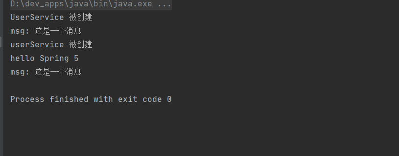

##spring ioc  demo 
```$xslt
分别基于 xml 、注解 、xml和注解的IOC混合demo
```


##项目结构
* Spring-preview  `基于xml`
    - spring-annotation  `基于注解`
        + spring-xmlAndAnnotation  `xml注解混合`

#### xml


#### 注解版


#### 注解 & xml
